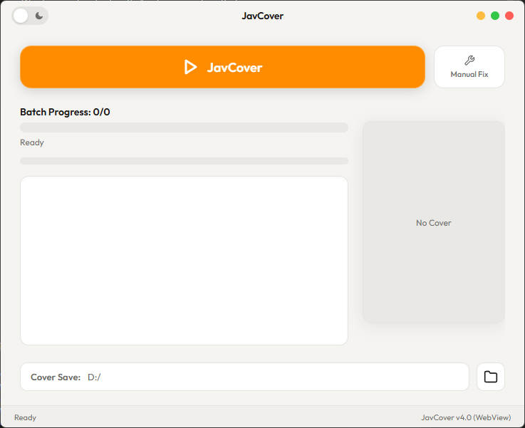
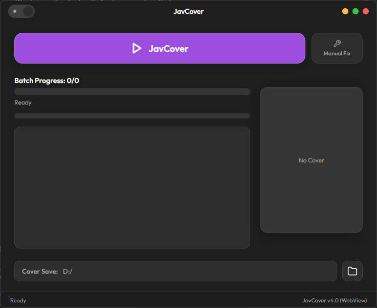

# Mosaic Rename (JavCover)

Automated tool for renaming JAV video files — fetches Japanese titles from JavTrailers, downloads cover art, and embeds it into MP4 metadata.

Now with **JavCover** GUI — just double-click the `.exe` to use, no Python required.

## 📦 Download

Go to [Releases](https://github.com/na2h2p207-hue/JavCover_Insert/releases) to download the latest `JavCover.exe`. Run it directly — no installation needed.

## 🌟 Core Features

- **Full SHT Website Format Support**: Accurately extracts codes and cleans titles regardless of messy prefixes or suffixes from SHT downloads.
- **Smart Title Cleaning**: Automatically sanitizes redundant Japanese actor names and strips irrelevant trailing Romaji added by scrapers.
- **Suffix Preservation**: Intelligently detects and preserves crucial video tags like `无码-lada` and `-C` through the renaming pipeline, ensuring uncensored info is never lost.
- **Video Structure Repair**: Built-in detection algorithm automatically intercepts and fixes `dat` atom corruption often introduced by editing tools like LosslessCut.
- **Faststart Optimization**: Standardizes files by shifting the MP4 `moov` atom directly to the front, enabling instant un-buffered playback across media players and web environments.
- **Safe Cover Embedding**: Intelligently aligns and crops cover art (378:538 ratio) before safely injecting it directly into the MP4 metadata via Mutagen engine.
- **Premium GUI UX**: A PyWebView-powered native desktop client featuring fluent liquid glass layouts and intuitive light/dark theme toggles.
- **Real-time Cover Preview & Saving**: Instantly preview intelligently cropped cover art in matching aspect ratio natively within the GUI during processing; cover image files are also securely auto-saved systematically in your selected local directory.
  <br>
- **Versatile Workflows**: Provides highly scalable batch processing for entire libraries and precise manual fixes for select single files instantly.

## Screenshots

### Light Theme


### Dark Theme


## Project Structure

```
├── JavCover_WebView.py     # GUI entry point (PyWebView)
├── gui/
│   ├── index.html          # Frontend structure
│   ├── style.css           # Styles (with Liquid Glass effect)
│   └── script.js           # Frontend logic
├── rename/
│   ├── rename_movies.py    # Core renaming logic
│   ├── manual_fix.py       # Single-file manual fix
│   └── faststart.py        # FFmpeg faststart utility
└── archive/
    └── build_artifacts/
        └── JavCover.spec   # PyInstaller build config
```

## CLI Usage

You can also use the tools from the command line without the GUI:

### Batch Processing

```powershell
# Dry run (preview)
python rename/rename_movies.py --dir "H:\Videos" --dry-run

# Live mode
python rename/rename_movies.py --dir "H:\Videos"
```

### Manual Fix Single File

```powershell
python rename/manual_fix.py "path\to\video.mp4"
```

## Dependencies

Only needed when running from source:

```bash
pip install pywebview pythonnet cloudscraper mutagen Pillow requests
```

## Code Formats

| Format | Example | Support Detail |
|--------|---------|----------------|
| Standard Hyphen | `ABW-009` | Perfect parsing |
| No Hyphen | `iptd00764` → `IPTD-764` | Auto-adds hyphen and trims zero-padding |
| DV Series (4-digit) | `DV-1234` | Specific 4-digit code extraction |
| SHT Website Format | `[SHT] SSNI-123_FHD...` | Deep filtering of noisy prefixes/suffixes |
| Complex Strings | `h_086ssni123` | Advanced RegExp extraction handling |

## License

This project is for personal and educational use only.
